# EMA Survey Schedule Generator

## Overview

This is an external module used to generate schedules for ecological momentary assessments (EMAs). The plugin page allows the user to generate a schedule with random times that surveys are sent to participants. A cron job in the background checks the scheduled times every minute, and marks surveys that should sent at that time.

## Installation

To install this external module, you will need filesystem access to the `modules` directory in your REDCap server. If you do not have access to this directory, contact your REDCap administration or IT team.

## Setup

### Required instruments and events

This external module requires certain hardcoded instruments and event names to exist in the project for it to properly function. Make sure these exist before enabling the module.

The following instruments are required:
- EMA Survey Setup
- EMA Survey Schedule

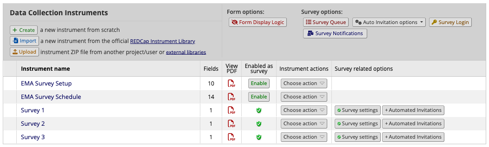

The easiest way would be to import the instrument zip files that comes with this external module. 

- The ZIP file for the EMA Survey Setup instrument can be downloaded [here](https://github.com/uofu-ccts/ema/raw/main/EMASurveySetup_v1.0.0.zip).
- The ZIP file for the EMA Survey Schedule instrument can be downloaded [here](https://github.com/uofu-ccts/ema/raw/main/EMASurveySchedule_v1.0.0.zip).

The EMA Survey Setup instrument should be designated in the `survey_setup_arm_1` event.

The EMA Survey Schedule instrument should exist in the events that also have the surveys, with the event names following the format `day_1_arm_1`, `day_2_arm_1`, `day_3_arm_1`, and so on. Make sure that the number of day_X events and the maximum number of surveys days is identical.

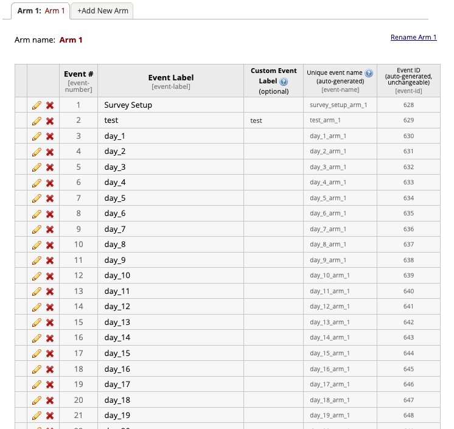

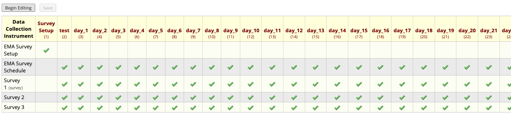

### Required fields

This external module requires certain hardcoded field names to exist in the project for it to properly function. Make sure these exist before enabling the module.

The following fields must exist in the EMA Survey Setup instrument:
- ema_survey_start_date
- ema_survey_num_days
- ema_survey_status
- At least one survey range start time (ema_survey_start_1 in zip file)
- At least one survey range expiration time (ema_survey_expire_1 in zip file)
- ema_survey_setup_complete (automatically generated by REDCap if instrument name is kept)

Survey start range times and survey expiration range times must be in pairs (if 1 start time, then 1 expiration time; if 2 start times, then 2 expiration times, and so on).

The following fields must exist in the EMA Survey Schedule instrument:
- ema_survey_send_date
- At least one time to send survey (ema_time_send_survey_1 in zip file)
- At least one flag to send survey (ema_send_survey_1 in zip file)
- At least one time to expire survey (ema_time_expire_survey_1 in zip file)
- At least one flag to expire survey (ema_expire_survey_1 in zip file)
- ema_survey_schedule_complete (automatically generated by REDCap if instrument name is kept)

For the times and flags for sending and expiring surveys, you must have the same number as the pair of start range times and expiration range times as in the EMA Survey Setup instrument. For example, if you will be sending three surveys a day, you will need the following fields:

EMA Survey Setup:
- ema_survey_start_date
- ema_survey_num_days
- ema_survey_status
- ema_survey_start_1
- ema_survey_expire_1
- ema_survey_start_2
- ema_survey_expire_2
- ema_survey_start_3
- ema_survey_expire_3
- ema_survey_setup_complete

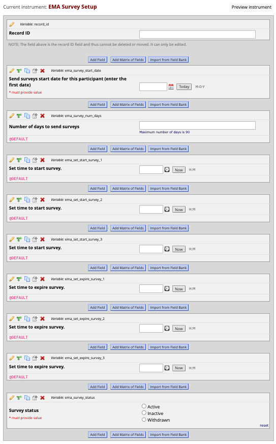

EMA Survey Schedule:
- ema_survey_send_date
- ema_time_send_survey_1
- ema_send_survey_1
- ema_time_expire_survey_1
- ema_expire_survey_1
- ema_time_send_survey_2
- ema_send_survey_2
- ema_time_expire_survey_2
- ema_expire_survey_2
- ema_time_send_survey_3
- ema_send_survey_3
- ema_time_expire_survey_3
- ema_expire_survey_3
- ema_survey_schedule_complete

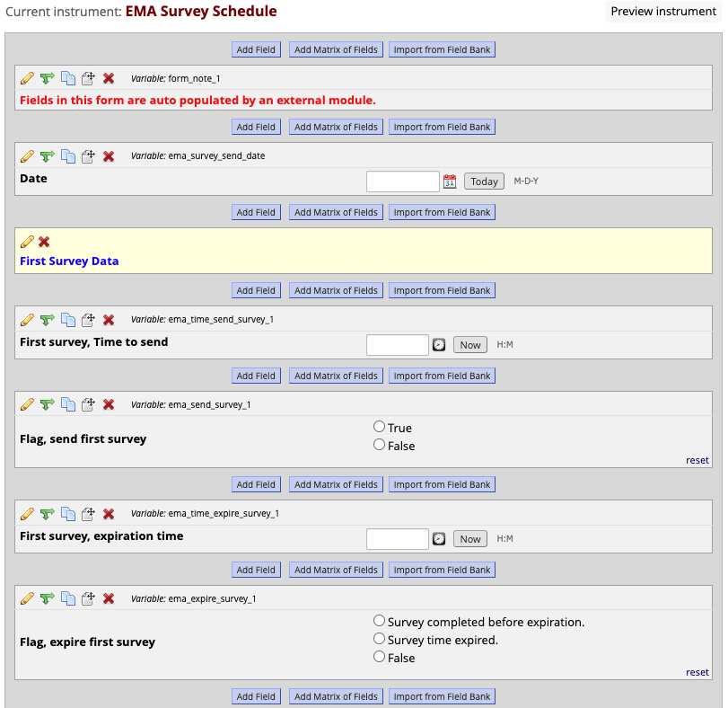
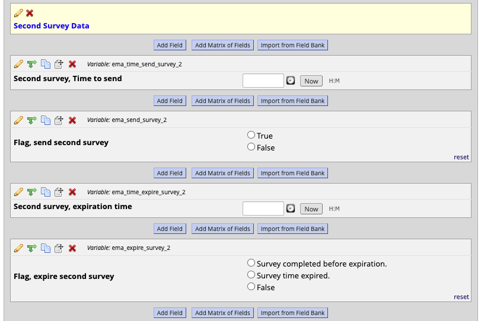
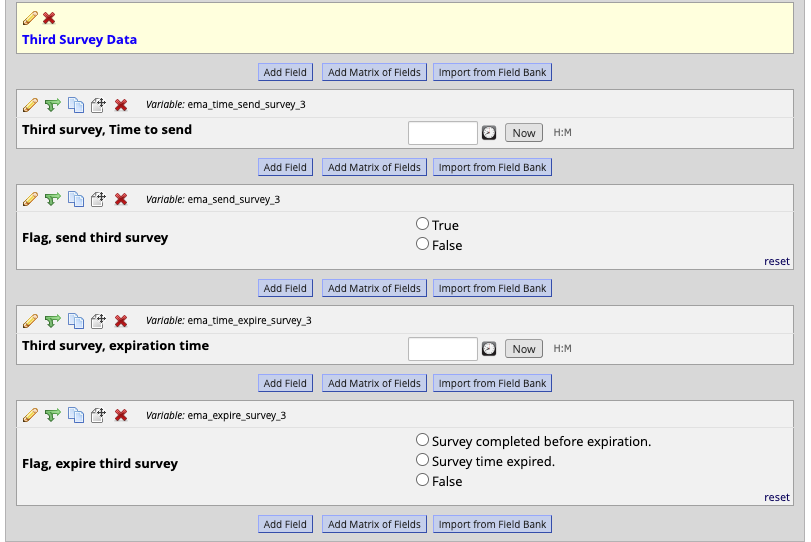

If using the zip files, make sure to modify the @DEFAULT fields that have been set to make study operations less cumbersome.

### External module configuration

Once the module is enabled, there are certain configurations that need to be set for the module to properly function.

First, you will have to select the earliest and latest times that surveys will be sent out. This will determine when the modules cron job (automatic schedule checker) will run.

Second, you will have to select the following fields:
- Field to SOURCE Time to Start Survey
- Survey time to send field
- Survey send flag field
- Field to SOURCE Time to Expire Survey
- Field to SAVE Survey time to expire
- Survey expire flag field
- Survey completion field (the completion field for the actual EMA survey beign sent to participants)

You will have a set of these for each survey sent during the day.

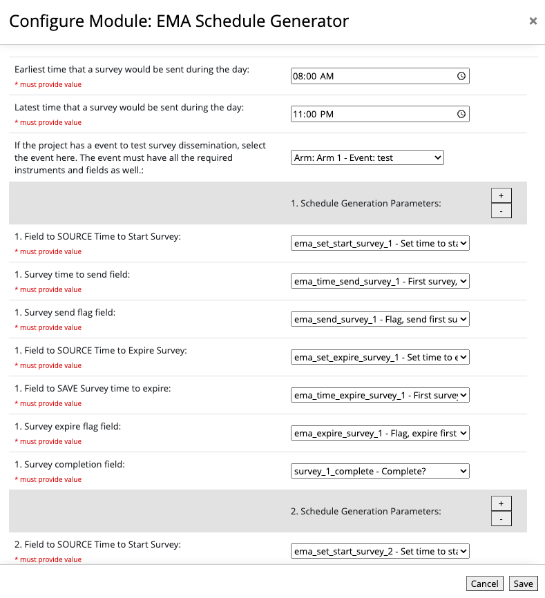

If you are following the previous example of three surveys a day, it will be like the following:

First set
- Field to SOURCE Time to Start Survey: ema_set_start_survey_1 - Set time to start survey.
- Survey time to send field: ema_time_send_survey_1 - First survey, Time to send
- Survey send flag field: ema_send_survey_1 - Flag, send first survey
- Field to SOURCE Time to Expire Survey: ema_set_expire_survey_1 - Set time to expire - survey.
- Field to SAVE Survey time to expire: ema_time_expire_survey_1 - First survey, expiration time
- Survey expire flag field: ema_expire_survey_1 - Flag, expire first survey
- Survey completion field: survey_1_complete - Complete?

Second set
- Field to SOURCE Time to Start Survey: ema_set_start_survey_2 - Set time to start survey.
- Survey time to send field: ema_time_send_survey_2 - Second survey, Time to send
- Survey send flag field: ema_send_survey_2 - Flag, send second survey
- Field to SOURCE Time to Expire Survey: ema_set_expire_survey_2 - Set time to expire survey.
- Field to SAVE Survey time to expire: ema_time_expire_survey_2 - Second survey, expiration time
- Survey expire flag field: ema_expire_survey_2 - Flag, expire second survey
- Survey completion field: survey_2_complete - Complete?

Third set
- Field to SOURCE Time to Start Survey: ema_set_start_survey_3 - Set time to start survey.
- Survey time to send field: ema_time_send_survey_3 - Second survey, Time to send
- Survey send flag field: ema_send_survey_3 - Flag, send second survey
- Field to SOURCE Time to Expire Survey: ema_set_expire_survey_3 - Set time to expire survey.
- Field to SAVE Survey time to expire: ema_time_expire_survey_3 - Second survey, expiration time
- Survey expire flag field: ema_expire_survey_3 - Flag, expire second survey
- Survey completion field: survey_3_complete - Complete?

Once the fields are selected, click Save.

### Setting up the Automated Survey Invitations to work with the module

The external module only works with the EMA Survey Setup and EMA Survey Schedule instrument data. It does not actually send out the surveys; this is done using built-in REDCap mechanisms, either for emails or SMS texting.

You will have to configure the instrument ASIs to send out the surveys when the Survey send flag field (ema_send_survey_X) is marked "True".

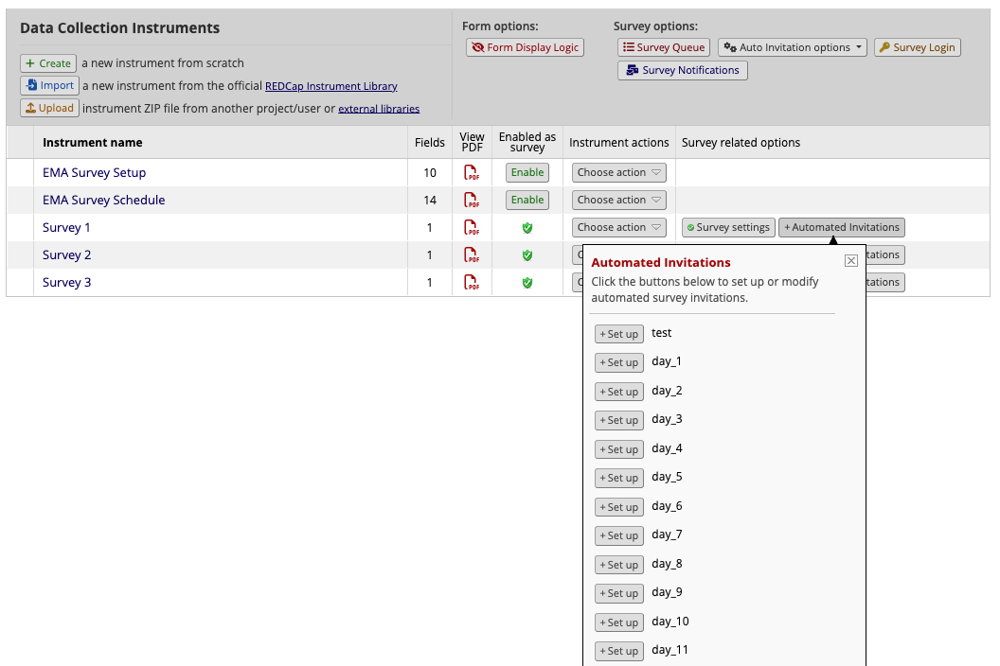

For each day event, you will need to enter the following logic in the "Specify conditions for sending invitations > When the following logic becomes true":
- Survey send flag field for that specific event is TRUE.

If you are following the prescribed example, the logic will be:

For ASIs for the first survey:
- [day_1_arm_1][ema_send_survey_1] = '1'
- [day_2_arm_1][ema_send_survey_1] = '1'
- [day_3_arm_1][ema_send_survey_1] = '1'
- [day_4_arm_1][ema_send_survey_1] = '1'
- [day_5_arm_1][ema_send_survey_1] = '1'
- [day_6_arm_1][ema_send_survey_1] = '1'
- ...and so on until [day_90_arm_1][ema_send_survey_1] = '1'

For ASIs for the second survey:
- [day_1_arm_1][ema_send_survey_2] = '1'
- [day_2_arm_1][ema_send_survey_2] = '1'
- [day_3_arm_1][ema_send_survey_2] = '1'
- [day_4_arm_1][ema_send_survey_2] = '1'
- [day_5_arm_1][ema_send_survey_2] = '1'
- [day_6_arm_1][ema_send_survey_2] = '1'
- ...and so on until [day_90_arm_1][ema_send_survey_2] = '1'

For ASIs for the third survey:
- [day_1_arm_1][ema_send_survey_3] = '1'
- [day_2_arm_1][ema_send_survey_3] = '1'
- [day_3_arm_1][ema_send_survey_3] = '1'
- [day_4_arm_1][ema_send_survey_3] = '1'
- [day_5_arm_1][ema_send_survey_3] = '1'
- [day_6_arm_1][ema_send_survey_3] = '1'
- ...and so on until [day_90_arm_1][ema_send_survey_3] = '1'

Make sure that the ASIs are configured to "Send Immediately", so that the surveys are sent out when the send flag is set to true by the external module.

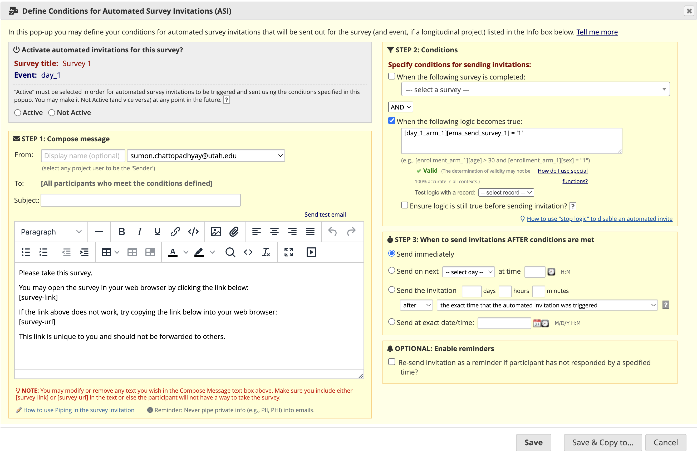

This will have to be configured for all 90 events for all 3 surveys, for a total of 270 ASIs. the "Save & Copy to..." button at the bottom should help configure. After using that button to copy the ASIs for that survey, the only parts that will need to be modified will be the event names.

### Setting up the branching logic for survey expiration

The external module does not *actually* expire the surveys when the expiration time is reached; it only flags the surveys to be expired. To hide the expired survey from participants, branching logic must be set using built-in REDCap functionality, either at the field level or instrument level.

The most common method would be to have a "This survey is expired" field at the top of the instrument, which shows when the expire flag is set to TRUE. The rest of the survey would be configured to only show when the expire flag is not set to TRUE.

For each survey, you will need to configure the following branching logic:
- For fields to show when survey is expired: Survey expire flag field is TRUE.
= For fields to show when survey is not expired: Survey expire flag field is NOT TRUE.

If you are following the prescribed example, the branching logic will be:

Branching logic for the first survey:
- For fields to show when survey expired: [ema_expire_survey_1] = '1'
- For fields to show when survey is NOT expired: [ema_expire_survey_1] <> '1'

Branching logic for the second survey:
- For fields to show when survey expired: [ema_expire_survey_2] = '1'
- For fields to show when survey is NOT expired: [ema_expire_survey_2] <> '1'

Branching logic for the third survey:
- For fields to show when survey expired: [ema_expire_survey_3] = '1'
- For fields to show when survey is NOT expired: [ema_expire_survey_3] <> '1'

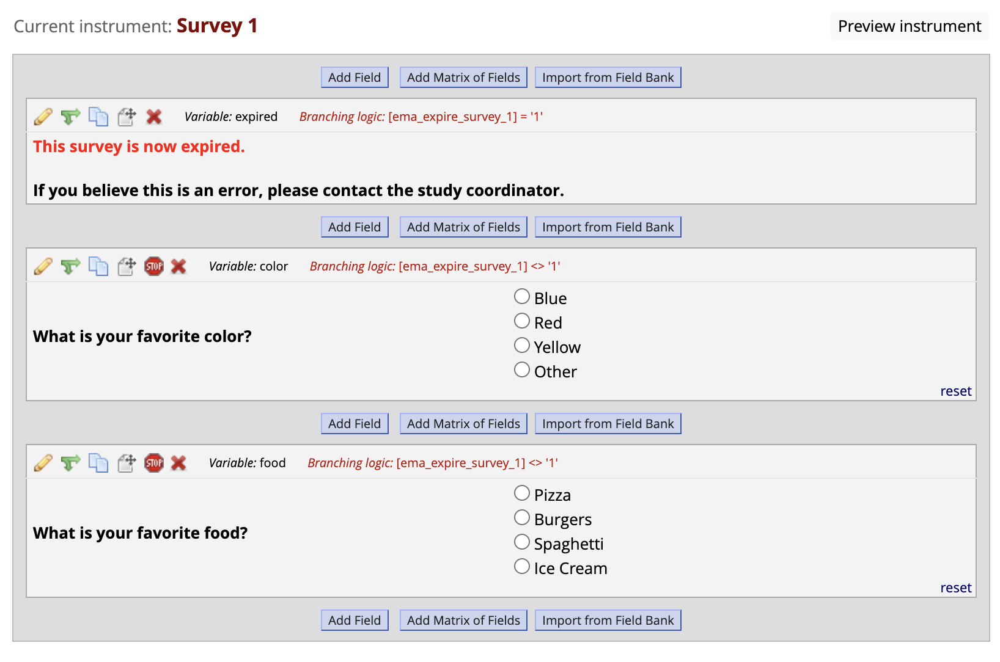

## How the module works

Once you have the module configurations set up, you can now start schedule the EMA surveys for your participants.

To do so, the EMA Survey Setup must be completed for that participant. Complete this instrument for as many participants as required.

Once these are marked complete, click the plugin page link to the left that says "Generate schedule".

In this page, the module will list all of the participants in the study that have a completed EMA Survey Setup instrument, but no EMA Survey Schedule generated yet.

Click the green button below the list of participants to generate a schedule for them.

Once scheduled, the randomly generated survey times will be saved in the corresponding EMA Survey Schedule instruments in REDCap. You should be able to see that these instruments have become marked "Incomplete" in the Record Status Dashboard.

The module will then check every minute to see if any survey schedules for today correspond to the current time. If it does, it will mark the "send" flag for that survey as "True". This field should be used in the logic for automated survey invitations to send out surveys to participants.

The module will also check every minute to see if any surveys need to be expired. If it does, it will mark the "expire" flag for that survey as "Survey time expired". This field should be used in the branching logic to "expire" the actual surveys sent out to participants.

If a participant completes a survey before the expiration time, the module will detect this at expiration time and mark the "expire" flag for that survey as "Survey completed before expiration".

Once all surveys for that day are expired, the module will mark the EMA Survey Schedule for that day/event "complete".
